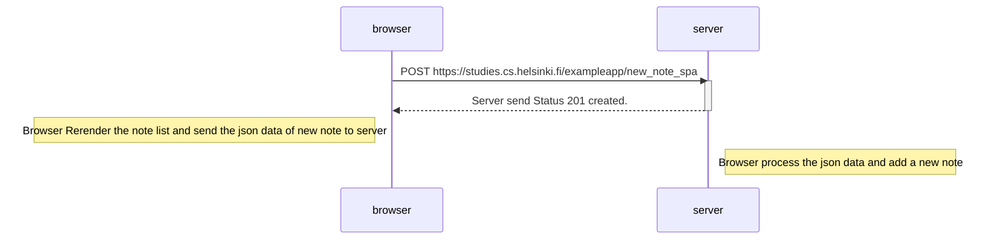

```mermaid
sequenceDiagram
    participant browser
    participant server

    browser->>server: POST https://studies.cs.helsinki.fi/exampleapp/new_note_spa
    activate server
    server-->>browser: Server send Status 201 created.
    deactivate server

    Note left of browser: Browser Rerender the note list and send the json data of new note to server 
    Note right of server: Browser process the json data and add a new note

   
```
